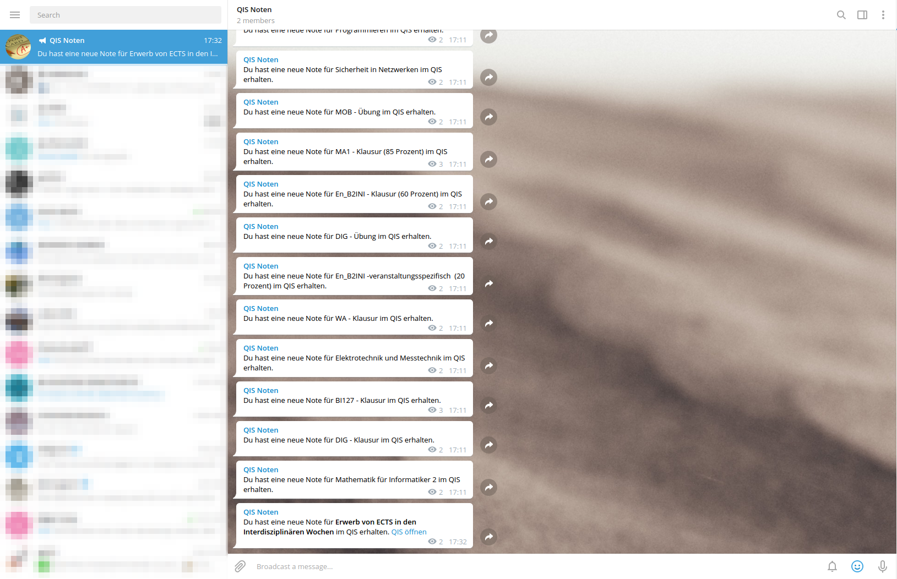

# qisbot
Small bot to inform you about new grades in the QIS system by using telegram notifications.

## Features
* Local cache / database
* Telegram notifications about new grades

# Telegram screenshot


## Configuration

This is how the qisbot configuration file (`.env`) should look like
```ini
## QIS settings
QIS_URL=https://qis.fh-kiel.de/qisserver
# refetch grades every 5 minutes
QIS_REFRESH=5

# qis credentials
QIS_USER=toni.tester@student.fh-kiel.de
QIS_PASSWORD=*****

# telegram bot settings (leave empty to disable)
TELEGRAM_TOKEN=
TELEGRAM_CHATID=

# logging settings
LOG=info
# LOG=debug
```

## Installation
* Create the .env file
* Run the docker container with:
```bash
docker-compose up # run container
docker-compose up -d # run container in background (usually what you want)
```
